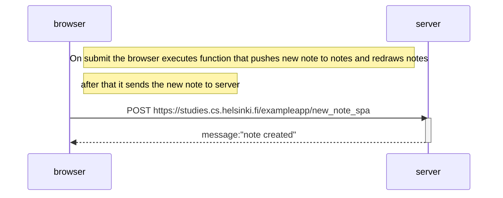

```mermaid
sequenceDiagram
    participant browser
    participant server
    

    Note right of browser: On submit the browser executes function that pushes new note to notes and redraws notes 
    Note right of browser: after that it sends the new note to server
    browser->>server: POST https://studies.cs.helsinki.fi/exampleapp/new_note_spa
    activate server
    server-->>browser: message:"note created"
    deactivate server

    
```